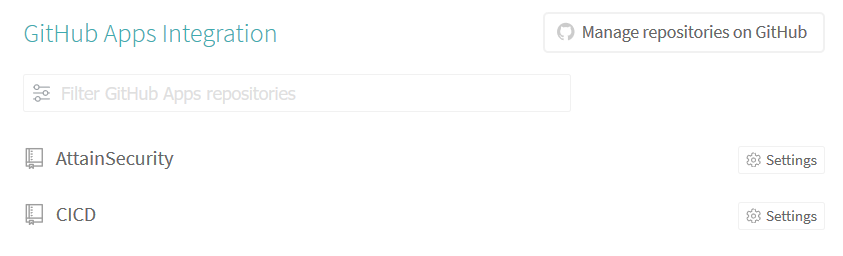

<!-- $theme: default -->

# Introduction of CI & CD

## Group Member:

* ## ZburNIngram & 李凌荟

* ## fourth homework of seproj
---

# Continuous Integration

The simplest way to test and deploy your projects.

> Easily sync your GitHub projects with Travis CI  
> you'll be testing your code in minutes.

### Most Important: 
## FREE, ALWAYS FREE!
---

# Basic Flow of Travis
## Branch Build Flow

## Pull Request Build Flow

---

# Steps to CI using Travis
---

* ## First Step : Sign Up with Github

---

* ## Second Step : Config .travis.yml

#### language: using java
#### sudo: offer permission
#### before_install: make it executable

---

* ## Third Step : Select the Project

### After that, the travis will automatically monitor the project

---

# Continuous Deployment
---
## First Step to CD: Login to Heroku

---
## Second Step: Create repo on heroku

---
## Third Step: push the repo to master branch

### Push Result (with compressing)

---
## Fourth Step: open the project on heroku

---
# Final Result with heroku CD

---
# Thanks
